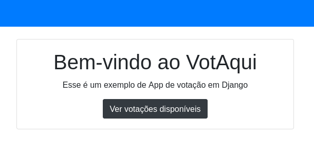
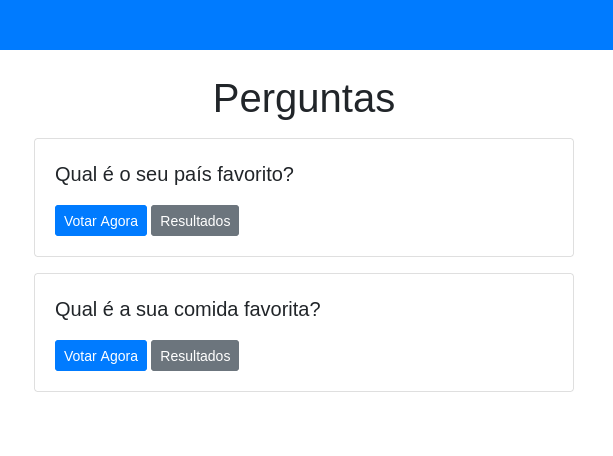
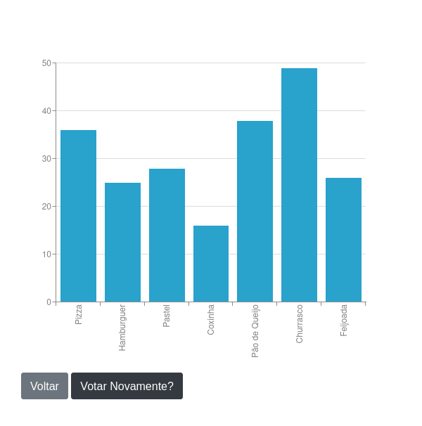

# VotAqui

**VotAqui** é um aplicativo de votação desenvolvido com Python e Django,que permite aos usuários criar perguntas e alternativas, submeter votos, armazenar os resultados em um banco de dados, contabilizar os votos e exibir os resultados em formato gráfico.



---

## Funcionalidades

- **Criação de perguntas:** Permite a definição de uma pergunta e suas respectivas alternativas.



- **Submissão de votos:** Usuários podem selecionar uma alternativa e enviar seu voto.


- **Armazenamento de dados:** Todos os votos são armazenados em um banco de dados.

- **Exibição de resultados:** Mostra o número de votos por alternativa e apresenta um gráfico interativo para visualização.




- **Interface responsiva:** Design limpo e responsivo utilizando Bootstrap.

---

## Tecnologias Utilizadas

- **Backend:**
  - Python
  - Django (Framework principal para desenvolvimento do backend e gerência do banco de dados).
- **Frontend:**
  - HTML
  - CSS (com Bootstrap 4)
  - JavaScript (para renderização de gráficos).
- **Banco de Dados:**
  - SQLite (default do Django, mas pode ser facilmente alterado para outros sistemas como PostgreSQL).
- **Gráficos:**
  - Biblioteca ZingChart para criação de gráficos dinâmicos.

---

## Instalando o Projeto

1. Clone este repositório:

   ```bash
   git clone https://github.com/seu-usuario/votaqui.git
   cd votaqui
   ```

2. Crie um ambiente virtual e ative-o:

   ```bash
   python -m venv venv
   source venv/bin/activate # No Windows: venv\Scripts\activate
   ```

3. Instale as dependências:

   ```bash
   pip install -r requirements.txt
   ```

4. Realize as migrações do banco de dados:

   ```bash
   python manage.py migrate
   ```

5. Inicie o servidor de desenvolvimento:

   ```bash
   python manage.py runserver
   ```

6. Acesse o aplicativo no navegador: [http://127.0.0.1:8000/](http://127.0.0.1:8000/)

---

## Utilizando o Aplicativo

1. **Criar uma pergunta:** Acesse o painel de administração do Django (http://127.0.0.1:8000/admin) e crie uma nova pergunta com alternativas.

2. **Submeter votos:** No aplicativo, clique na pergunta para abrir a tela de votação e selecione uma alternativa.

3. **Visualizar resultados:** Após votar, veja os resultados atualizados com o número total de votos e o gráfico dinâmico.

---

## Licença

Este projeto é distribuído sob a licença MIT. Consulte o arquivo LICENSE para obter mais detalhes.

